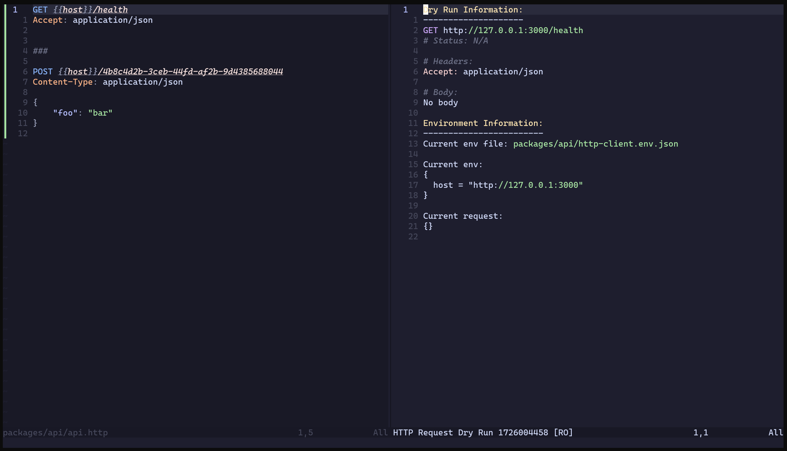
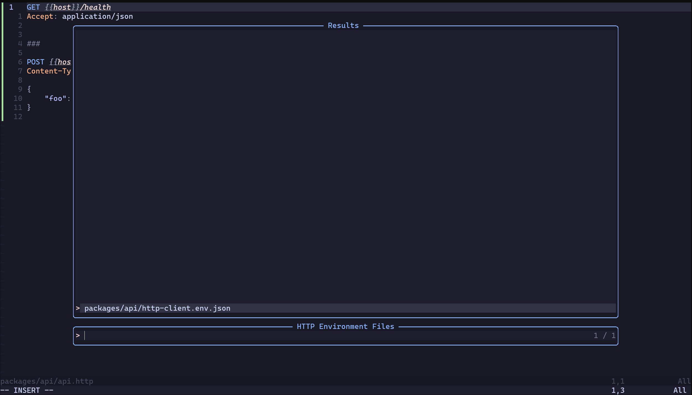
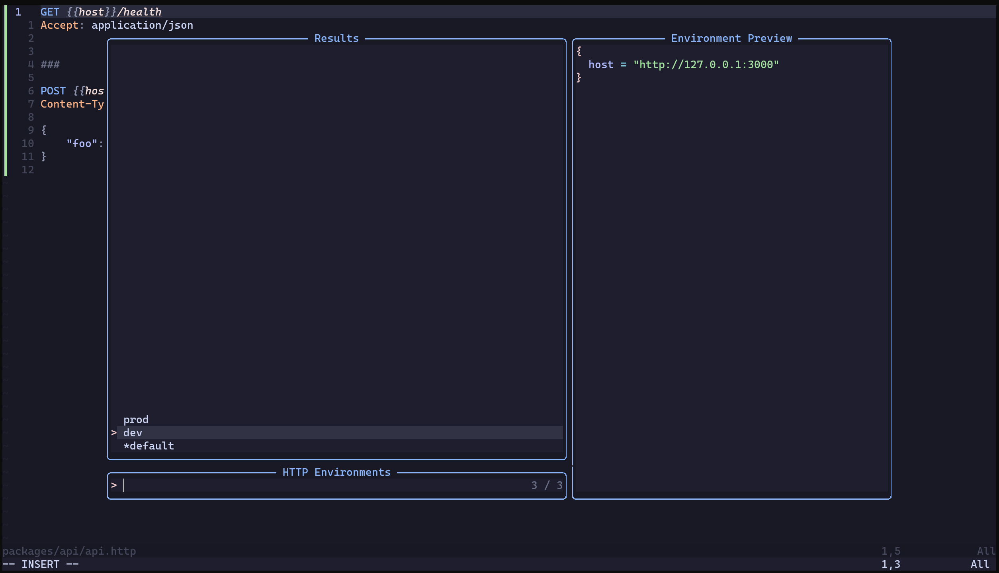

# Neovim HTTP Request Plugin

A Neovim plugin for running HTTP requests directly from .http files, with support for environment variables. Inspired by the IntelliJ HTTP Client, this plugin brings similar functionality to Neovim in an easy-to-install and easy-to-use package.

The core goal is to ensure compatibility with .http files from IntelliJ or VSCode, allowing them to run smoothly in Neovim and vice-versa.


**Development is ongoing, with new features added as needed or when time permits.**


## Table of Contents

- [Features](#features)
- [Installation](#installation)
  - [Configuration](#configuration)
- [Usage](#usage)
    - [Commands](#commands)
    - [Keybindings](#keybindings)
    - [Response handler](#response-handler)
- [Telescope Integration](#telescope-integration)
- [Documentation](#documentation)
- [Examples](#examples)
  - [Environment Files](#environment-files)
- [Contributing](#contributing)
- [License](#license)
- [Screenshots](#screenshots)
  - [Dry Run](#dry-run)
  - [Environment File Selection](#environment-file-selection)
  - [Environment Selection](#environment-selection)
  - [HTTP Response](#http-response)

## Features

- Run HTTP requests from .http files
- Support for environment variables
- Easy switching between different environments
- Non-blocking requests
- Pretty-printed response display in a separate buffer
- Automatic formatting for JSON and XML responses
- Syntax highlighting for .http files and response buffers
- Verbose mode for debugging
- Dry run capability for request inspection
- Telescope integration for environment selection
- Compatible with [JetBrains HTTP Client](https://www.jetbrains.com/help/idea/http-client-in-product-code-editor.html) and [VSCode Restclient](https://github.com/Huachao/vscode-restclient)

## Installation

This plugin is designed to be installed with [Lazy.nvim](https://github.com/folke/lazy.nvim).

Add the following to your Neovim configuration:

```lua
{
  "heilgar/nvim-http-client",
  dependencies = {
    "nvim-lua/plenary.nvim",
  },
  config = function()
    require("http_client").setup({
      -- Optional: Configure default options here
    })
  end,
}
```

### Configuration

This plugin can be configured automatically using the `after/plugin` directory. The default configuration is set in `after/plugin/http_client.lua`. You can override these settings by creating your own `after/plugin/http_client.lua` file in your Neovim configuration directory.

Example configuration:

```lua
if not pcall(require, "http_client") then
  return
end

local http_client = require("http_client")

local config = {
  default_env_file = '.env.json',
  request_timeout = 30000, -- 30 seconds
  keybindings = {
    select_env_file = "<leader>hf",
    set_env = "<leader>he",
    run_request = "<leader>hr",
    stop_request = "<leader>hs",
    dry_run = "<leader>hd",
    toggle_verbose = "<leader>hv"
  },
}

http_client.setup(config)

-- Set up Telescope integration if available
if pcall(require, "telescope") then
  require("telescope").load_extension("http_client")

  -- Set up Telescope-specific keybindings
  vim.api.nvim_set_keymap('n', '<leader>hf', [[<cmd>Telescope http_client http_env_files<CR>]], { noremap = true, silent = true })
  vim.api.nvim_set_keymap('n', '<leader>he', [[<cmd>Telescope http_client http_envs<CR>]], { noremap = true, silent = true })
end
```

You can adjust these settings to your preferences.

## Usage

1. Create a `.http` file with your HTTP requests.
2. Create a `.env.json` file with your environments.
3. Use the provided commands to select an environment and run requests.


### Commands

- `:HttpEnvFile`: Select an environment file (.env.json) to use.
- `:HttpEnv {env}`: Set the current environment to use (e.g., `:HttpEnv production`).
- `:HttpRun`: Run the HTTP request under the cursor.
- `:HttpRunAll`: Run all HTTP requests in the current file.
- `:HttpStop`: Stop the currently running HTTP request.
- `:HttpVerbose`: Toggle verbose mode for debugging.
- `:HttpDryRun`: Perform a dry run of the request under the cursor.

### Keybindings

The plugin comes with the following default keybindings:

- `<leader>he`: Select environment file
- `<leader>hs`: Set current environment
- `<leader>hr`: Run HTTP request under cursor
- `<leader>hx`: Stop running HTTP request
- `<leader>hv`: Toggle verbose mode
- `<leader>hd`: Perform dry run

To customize these keybindings, you can add the following to your Neovim configuration:

```lua
{
    "heilgar/nvim-http-client",
    dependencies = {
        "nvim-lua/plenary.nvim",
    },
    config = function()
        require("http_client").setup()
    end,
    keys = {
        { "<leader>he", "<cmd>HttpEnvFile<cr>", desc = "Select HTTP environment file" },
        { "<leader>hs", "<cmd>HttpEnv<cr>", desc = "Set HTTP environment" },
        { "<leader>hr", "<cmd>HttpRun<cr>", desc = "Run HTTP request" },
        { "<leader>hx", "<cmd>HttpStop<cr>", desc = "Stop HTTP request" },
        { "<leader>hv", "<cmd>HttpVerbose<cr>", desc = "Toggle verbose mode" },
        { "<leader>hd", "<cmd>HttpDryRun<cr>", desc = "Perform dry run" },
    },
    cmd = {
        "HttpEnvFile",
        "HttpEnv",
        "HttpRun",
        "HttpStop",
        "HttpVerbose",
        "HttpDryRun"
    },
}
```

You can change the key mappings by modifying the `keybindings` table in the setup function and updating the `keys` table accordingly.

### Response Handler
```http
### Set Token
POST {{base_url}}/login
Content-Type: application/json

{
    "username": "{{username}}",
    "password": "{{password}}"
}

> 

### Get Protected Resource
GET {{base_url}}/protected
Authorization: Bearer {{auth_token}}
```

### Running Without Environment
You can now run requests without selecting an environment file. If environment variables are needed but not set, the plugin will display a message suggesting to select an environment file or set properties via a response handler.

Dry runs can be executed even if no environment file is selected. In this case, a warning will be displayed in the dry run output if environment variables are needed but not set.

## Telescope Integration

This plugin can be integrated with Telescope for a more interactive experience in selecting environment files and environments. To use the Telescope integration:

1. Make sure you have Telescope installed and configured.
2. Load the extension in your Neovim configuration:

```lua
require('telescope').load_extension('http_client')
```

3. Use the following commands to access HTTP Client features through Telescope:

- `:Telescope http_client http_env_files`: Browse and select HTTP environment files
- `:Telescope http_client http_envs`: Browse and select HTTP environments

You can also create key mappings for these commands:

```lua
vim.api.nvim_set_keymap('n', '<leader>hf', [[<cmd>Telescope http_client http_env_files<CR>]], { noremap = true, silent = true })
vim.api.nvim_set_keymap('n', '<leader>he', [[<cmd>Telescope http_client http_envs<CR>]], { noremap = true, silent = true })
```

Note: You need to select an environment file using `http_env_files` before you can select an environment using `http_envs`.

## Documentation

After installing the plugin, you can access the full documentation by running `:h http_client` in Neovim.

## Examples

```
GET {{host}}/api/users

###

POST {{host}}/api/users
Content-Type: application/json

{
    "name": "John Doe",
        "email": "john@example.com"
}
```

### Environment Files

Environment files (.env.json) allow you to define different sets of variables for your HTTP requests. The plugin will look for these files in your project root directory.

The `*default` environment is used as a base, and other environments will override its values.

```json
{
    "*default": {
        "host": "http://localhost:3000"
    },
        "production": {
            "host": "https://api.example.com"
        }
}
```

## Contributing

Contributions are welcome! Please feel free to submit a Pull Request.

## License

This project is licensed under the MIT License. See the [LICENSE](LICENSE) file for details.

## Screenshots

### Dry Run

This screenshot shows the dry run feature, which allows you to preview the HTTP request before sending it.

### Environment File Selection

Here you can see the environment file selection process, where you choose the .env.json file to use for your requests.

### Environment Selection

This image demonstrates the environment selection within a chosen .env.json file, allowing you to switch between different configurations.

### HTTP Response

This screenshot displays how HTTP responses are presented after executing a request.

